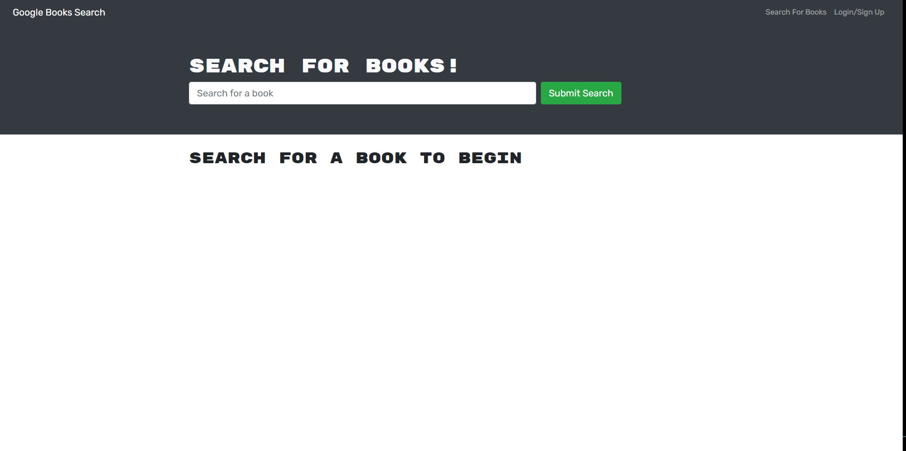
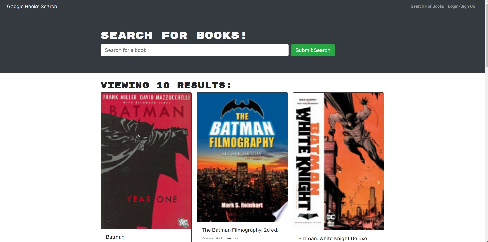
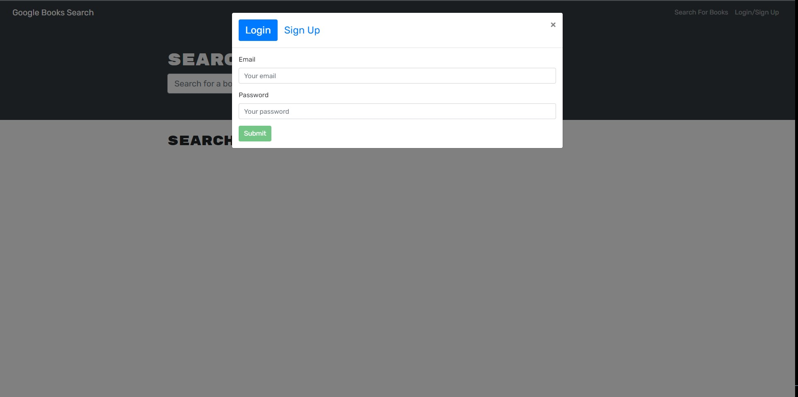

# BOOK_SEARCH_ENGINE

### Table of Contents

- [Description](#description)
- [Contributors](#contributors)
- [Installation](#installation)
- [Technologies_Used](#technologies_used)
- [Media](#media)

## Description:

Book Search Engine is a book search application that searches for books you choose and stores your selections in a database that allows you to retrieve the ones you've saved and remove the ones you no longer care to keep.

### Contributors

Alfonso Robles

#### Installation

- `npm install`
- `npm i apollo-graphql`
- `npm run develop`
- `npm start`

#### Technologies_Used

- MongoDB
- Apollo Server
- Express
- GraphQL

#### Media

[Book_Search_Engine](https://vast-escarpment-69922.herokuapp.com/)

- 
- 
- 
